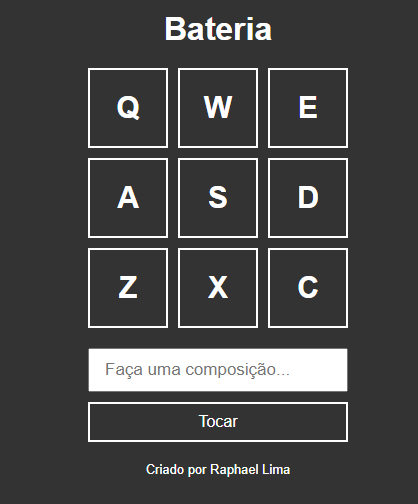

# bateria
Projeto usando a linguagem de programação JavaScript que simula uma bateria musical pelo teclado.

## Minha aplicação:

## Sobre a aplicação:

Projeto usa javaScript para ouvir e capturar quando o usuário pressiona determinadas teclas do teclado (Q,W,E,A,S,D,Z,X,C), 
cada tecla está ligada a um arquivo de áudio, a aplicação identifica qual tecla foi pressionada e aciona o áudio.
Além disso o usuário tem a possibilidade de criar uma composição musical com os áudios disponíveis no projeto.

## Por que essa aplicação?

Esse projeto foi ensinado em um workshop da empresa b7web, foi realizado no intuito de desenvolver minha lógica de programação 
e acrescentar um projeto interessante em meu portfólio pessoal.
